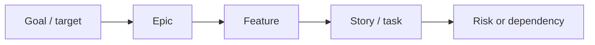

# Visual Patterns

Use visuals in every substantial Azure DevOps delivery output. Keep them compact, readable, and portable across clients. Default to an artifact-first report when the client supports rendered dashboards, charts, cards, images, or report artifacts.

## Artifact-First Standard

When artifact rendering is available, create a dashboard/report artifact before the text summary. Do not stop at plain text or normal Markdown tables for PMO, sprint, daily, capacity, Delivery Plan, risk, backlog, dashboard, or team reports.

The minimum dashboard-grade layout is:

1. Title band with report name, project, team, sprint, reporting date, and generated time.
2. Context cards for organization/project/team/sprint or roadmap/release.
3. KPI cards with large numbers, short subtitles, and RAG color: Green, Amber, Red, or Info.
4. Primary chart: horizontal bar, stacked status bar, aging chart, timeline, or heatmap.
5. Legend with color meaning and text labels.
6. Detail section: compact table with item IDs, owners, work type, state, dates, work/capacity, and RAG badges.
7. Action register with owner, next action, item IDs, and risk removed.

If rendering is not available, mimic the same structure in portable Markdown. If a report only has paragraphs plus a normal table, revise it.

## Visual Reporting Standard

Do not satisfy a substantial report with only a scope table. Use multiple visual families when data supports them:

1. KPI/RAG strip: delivery health, scope, done, active, blockers, bugs, estimates, capacity.
2. Distribution chart: scope by type, state, priority, severity, owner, area, iteration, tag, epic, feature, or delivery plan.
3. Progress or trend chart: completed vs remaining, aging, throughput, carryover, bug trend, capacity vs completed work.
4. Risk/dependency visual: heatmap, matrix, dependency map, or register.
5. Action visual: owner action board, team focus matrix, decision register, or PMO action register.

If the client can render rich visuals, create chart artifacts, generated dashboard images, report artifacts, or Mermaid diagrams. If not, use portable Markdown chart tables with bars and RAG labels.

## Dashboard Visual Style

Use a professional delivery dashboard style:

- Background: clean light dashboard or dark operations dashboard, depending on client/theme.
- Cards: metric cards with large numbers and small explanatory subtitles.
- Colors: Green for healthy/complete, Amber for watch/partial, Red for risk/action, Blue/Info for neutral data.
- Charts: use horizontal bars by default for owner load, completed work, capacity, open bugs, aging, delivery risk, state distribution, and priority distribution because names are readable.
- Tables: use colored RAG pills/badges, not just text status.
- Text: use short labels and one-sentence interpretation under visuals.

Avoid decorative gradients, vague icons, and long paragraphs. The dashboard should feel like something a delivery lead or PMO can show in a meeting.

## Sorting Standard

Never rely on API/default order for report tables or charts. Choose an order that matches the decision the user needs to make:

| Report Area | Default Sort |
| --- | --- |
| Team/member reports | Team member name A-Z |
| Ranked team/member charts | Highest value first, and title as `Top ... by ...` |
| Daily capacity vs completed work | Team member name A-Z in tables; completed work descending only for ranked charts |
| Risks | Red, Amber, Green, Info; then impact, likelihood, age, and due/target date |
| Dependencies | Blocking/blocked first, then needed-by date, then owner |
| Target dates | Overdue first, then earliest target date; missing dates in a separate warning group |
| Aging | Oldest or highest age first |
| Bugs | Severity/priority first, then oldest, then owner |
| Backlog gaps | Missing owner, estimate, target date, parent, acceptance criteria, then stale items |
| Pipelines/builds | Failed, partially succeeded, canceled, running, succeeded; then newest run |
| Test plans/cases | Failed/blocked/not run first, then suite/name |
| Dashboards/widgets | Dashboard name A-Z, then widget name A-Z |
| Action registers | Highest risk/priority first, then due date, then owner name |

If the user asks for a different order, follow the user's order and mention it in the section title.

## Header Standard

Use stable, business-friendly headers so repeated reports are easy to compare. Avoid vague headers such as `Visual`, `Data`, `Thing`, `Result`, or `Notes` when a specific label is possible.

Recommended headers:

- Work item tables: `Item ID`, `Title`, `Type`, `State`, `Owner`, `Sprint`, `Target Date`, `Completed Work`, `Remaining Work`, `RAG`, `Next Action`.
- Team tables: `Team Member`, `Capacity`, `Completed Work`, `Remaining Work`, `Utilization`, `Closed Items`, `RAG`, `Evidence`.
- Risk tables: `Risk Level`, `Risk`, `Evidence`, `Impact`, `Likelihood`, `Owner`, `Needed By`, `Next Action`.
- Delivery Plan tables: `Epic/Feature`, `State`, `Owner`, `Start Date`, `Target Date`, `Date Risk`, `Dependencies`, `Next Action`.
- Pipeline/test tables: `Name`, `Latest Status`, `Last Run`, `Failure Signal`, `Owner`, `Next Action`.

Use the same header labels across chart titles, table headers, and action sections whenever possible.

## Visual Selection

- Daily brief: KPI/RAG strip, done/active/blocked chart, bug/blocker matrix, team action board.
- Sprint health: RAG scorecard, completed-vs-remaining progress bar, scope/state chart, bug/blocker chart, capacity visibility, carryover risk matrix.
- Backlog health: readiness scorecard, missing-data heatmap, priority/state distribution, stale-age chart, cleanup action board.
- Delivery Plan: confidence scorecard, epic/feature progress chart, target-date risk table, dependency map, decision register.
- Risk/dependency: risk heatmap, dependency map, dependency register, action board.
- Team member focus: personal KPI strip, assigned-work state chart, urgency matrix, top-3 action board.
- Trend/improvement: throughput trend, before/after scorecard, carryover trend, aging trend, improvement action board.
- PMO status: executive KPI cards, scope/state distribution, risk heatmap, dependency map/register, aging/owner chart, action register.
- Engineering readiness: pipeline status chart, repo/test/dashboard availability matrix, release risk register.

## Visual Density Rule

For most reports, use this order:

1. KPI/RAG strip with 4-6 numbers.
2. Primary chart or graph.
3. Secondary risk, dependency, aging, bug, or capacity visual.
4. Action or decision register.
5. Optional Mermaid map when it adds clarity.

Keep narrative under each visual to one sentence. If the report is getting long, remove explanation before removing the visual.

## RAG Standard

Use color wherever the client can display it. In portable Markdown, include labels:

- Red: action required now, blocked, off track, or high risk.
- Amber: watch, validate, or plan action.
- Green: on track or no action needed.
- Info: neutral fact or data note.

Never rely on color alone; include the label too.

When a client supports rich rendering, show RAG as colored cards, badges, pills, bar colors, or heatmap cells. If color is unavailable, show the text label first, for example `Red - blocked by dependency`.

## KPI/RAG Strip

```markdown
| Health | Scope | Done | Active | Blocked | Main Gap |
| --- | ---: | ---: | ---: | ---: | --- |
| Red | 27 | 0 | 12 | 3 | 9 missing estimates |
```

## KPI Card Layout

```markdown
| Metric | Value | RAG | Meaning |
| --- | ---: | --- | --- |
| Delivery confidence | Amber | Amber | Progress visible, but bug risk exists |
| Completed items | 14 | Green | Scope is moving |
| Open bugs | 5 | Amber | Quality needs daily review |
| Missing estimates | 9 | Red | Capacity forecast is weak |
```

## Chart-Style Scope Table

```markdown
| Type | Count | State Mix |
| --- | ---: | --- |
| Epic | 5 | To Do 2 / Active 2 / Done 1 |
| Feature | 6 | To Do 1 / Active 4 / Done 1 |
| Story/Task | 18 | To Do 6 / Active 8 / Done 4 |
| Bug | 5 | Active 4 / Resolved 1 |
```

## Completed vs Remaining Bar

Use this for sprint, PMO, Delivery Plan, and daily progress reports.

```markdown
| Measure | Count | Progress |
| --- | ---: | --- |
| Done | 14 | Done: 14 |
| Active | 12 | Active: 12 |
| Remaining | 9 | Remaining: 9 |
```

## Capacity vs Completed Work

Use this when capacity, owner load, completed work, remaining work, effort, or story points exist.

```markdown
| Team member | Capacity | Completed | Remaining | Delta | Capacity Delta |
| --- | ---: | ---: | ---: | ---: | --- |
| Name A | 8h/day | 6h | 10h | Watch | Capacity 8 / Done 6 / Remaining 10 |
| Name B | 8h/day | 10h | 2h | Good | Capacity 8 / Done 10 / Remaining 2 |
```

If hours are unavailable, use issue counts or story points and label the unit clearly.

## Daily Capacity vs Completed Work Dashboard

Use this pattern for yesterday/team work reports, daily capacity, utilization, and completed-work evidence.

Rendered artifact sections:

1. Header: `PROJECT - TEAM - Daily Capacity vs Completed Work`.
2. Context cards: organization, project, team, sprint, report date.
3. KPI cards:
   - Work items closed.
   - Completed work.
   - Capacity sum.
   - Top performer or main data gap.
   - Utilization/RAG if capacity exists.
4. Horizontal bar chart:
   - X-axis: completed work or utilization.
   - Y-axis: team member.
   - Bar color: Green >= 80% utilization, Amber 50-79%, Red < 50%, Info when capacity missing.
5. Per-member breakdown:
   - Team member.
   - Items closed.
   - Hours/completed work.
   - Capacity.
   - Utilization.
   - RAG badge.
   - Work item IDs.
   - Work item types.
6. Data confidence card:
   - Capacity available or missing.
   - Day-off data available or missing.
   - Completed-work fields complete or missing.

Portable Markdown fallback:

```markdown
| Metric | Value | RAG | Meaning |
| --- | ---: | --- | --- |
| Work items closed | 27 | Green | Strong daily completion signal |
| Completed work | 50h | Green | Good evidence of output |
| Capacity available | 0h | Red | Cannot calculate true utilization |
| Day-off data | Missing | Amber | Cannot distinguish off-day from zero output |
```

```markdown
| Team member | Completed | Capacity | Utilization | RAG | Work item IDs |
| --- | ---: | ---: | ---: | --- | --- |
| Name A | 6h | 6h | 100% | Green | #101, #102 |
| Name B | 0h | 6h | 0% | Red | None |
| Name C | 0h | 0h | n/a | Info | Day off |
```

Never treat zero completed work as a people-performance issue unless capacity and day-off data are available and the report has checked for in-progress work, blockers, support work, reviews, and meetings.

## Risk Heatmap

```markdown
| Risk Area | Level | Likelihood | Impact | Trigger | Action |
| --- | --- | --- | --- | --- | --- |
| Estimation gap | Red | High | High | 9 items unestimated | Estimate MVP slice |
| Bug risk | Amber | Medium | High | 5 open bugs | Assign fix owners |
```

## Aging Chart

```markdown
| Age Bucket | Count | Meaning |
| --- | ---: | --- |
| 0-7 days | 18 | Fresh |
| 8-14 days | 6 | Watch |
| 15+ days | 3 | Action needed |
```

## Team Action Table

```markdown
| Owner | Focus today | ADO items | Risk removed |
| --- | --- | --- | --- |
| Name | Action | ID-1, ID-2 | What improves |
```

## Risk Register

```markdown
| Risk | Impact | Evidence | Owner | Next action |
| --- | --- | --- | --- | --- |
| Risk name | High/Medium/Low | ADO fact | Name | Action |
```

## Mermaid Dependency Map

Use only when the client supports Mermaid or the user asks for diagrams. Keep labels short.



If Mermaid is not suitable, replace it with a dependency table.

## Visual Artifact Guidance

When the client supports generated visual artifacts, prefer a compact dashboard image/report over plain tables for executive or PMO requests. Use:

- KPI cards for top metrics.
- Horizontal bar charts for capacity, owner load, state, priority, severity, or scope distribution.
- Stacked bars for To Do / Active / Done.
- Line charts only when historical snapshots exist.
- RAG heatmaps for risks, dependencies, readiness, missing data, and aging.

Do not invent history, capacity, velocity, story points, effort, or estimates. If data is missing, show a data-gap visual instead of a fake chart.
