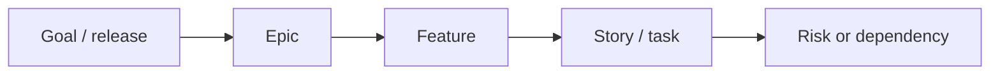

# Visual Patterns

Use visuals in every substantial Jira delivery output. Keep them compact, readable, and portable across clients. Default to a visual-first report: KPI/RAG first, charts second, short interpretation last.

## Visual Reporting Standard

Do not satisfy a substantial report with only a scope table. Use multiple visual families when data supports them:

1. KPI/RAG strip: delivery health, scope, done, active, blockers, bugs, estimates, capacity.
2. Distribution chart: scope by type, status, priority, assignee, component, label, epic, or release.
3. Progress or trend chart: completed vs remaining, aging, throughput, velocity, carryover, cycle time, or created/resolved trend.
4. Risk/dependency visual: heatmap, matrix, dependency map, or register.
5. Action visual: owner action board, team focus matrix, or decision register.

If the client can render rich visuals, create chart artifacts, generated dashboard images, or Mermaid diagrams. If not, use portable Markdown chart tables with colored bars and colored RAG markers.

## Visual Selection

- Daily brief: KPI/RAG strip, done/active/blocked chart, blocker/risk matrix, team action board.
- Sprint health: RAG scorecard, completed-vs-remaining progress bar, scope/status chart, bug/blocker chart, carryover risk matrix.
- Backlog health: readiness scorecard, missing-data heatmap, priority/status distribution, stale-age chart, cleanup action board.
- Roadmap: roadmap confidence scorecard, epic/feature progress chart, dependency map, decision register.
- Risk/dependency: risk heatmap, dependency map, dependency register, action board.
- Team member focus: personal KPI strip, assigned-work status chart, urgency matrix, top-3 action board.
- Trend/improvement: throughput trend, before/after scorecard, carryover trend, aging trend, improvement action board.
- PMO status: executive KPI cards, scope/status distribution, risk heatmap, dependency map/register, aging/owner chart, action register.

## Visual Density Rule

For most reports, use this order:

1. KPI/RAG strip with 4-6 numbers.
2. Primary chart or graph.
3. Secondary risk, dependency, aging, or capacity visual.
4. Action or decision register.
5. Optional Mermaid map when it adds clarity.

Keep narrative under each visual to one sentence. If the report is getting long, remove explanation before removing the visual.

## Color And RAG Standard

Use color wherever the client can display it. In portable Markdown, use these colored markers:

- Red: `🔴 Red` for blocked, off track, or action required now.
- Amber: `🟠 Amber` for watch, validate, or plan action.
- Green: `🟢 Green` for on track or no action needed.
- Blue: `🔵 Info` for neutral facts or data notes.

For bars:

- Done/completed: green blocks `🟩`
- Active/in progress: blue blocks `🟦`
- To Do/remaining: gray or white blocks `⬜`
- Blocked/high risk: red blocks `🟥`
- Watch/medium risk: orange blocks `🟧`

If a client strips emoji or color, fall back to `Red`, `Amber`, `Green` text. Never rely on color alone; include the label too.

Avoid generic column names such as `Visual`. Use specific chart labels: `Progress`, `Status Mix`, `Risk Level`, `Aging`, `Owner Load`, `Trend`, `Capacity Delta`, or `Flow`.

## KPI/RAG Strip

```markdown
| Health | Scope | Done | Active | Blocked | Main Gap |
| --- | ---: | ---: | ---: | ---: | --- |
| 🔴 Red | 27 | 0 | 0 | 0 | 27 unestimated |
```

Use RAG consistently:

- 🟢 Green: on track or no action needed.
- 🟠 Amber: watch, validate, or plan action.
- 🔴 Red: decision/action required now.

## KPI Card Layout

Use this when the client supports richer Markdown/HTML or visual artifacts. Keep it readable in plain text too.

```markdown
| Metric | Value | RAG | Meaning |
| --- | ---: | --- | --- |
| Delivery confidence | Red | 🔴 Red | No active or completed work |
| Completed items | 0 | 🔴 Red | Nothing done yet |
| Blockers | 0 | 🟢 Green | No blockers recorded |
| Missing estimates | 27 | 🔴 Red | Capacity cannot be forecast |
```

## Chart-Style Scope Table

Use short bars so the report feels visual even in plain Markdown.

```markdown
| Type | Count | Status Mix |
| --- | ---: | --- |
| Epic | 5 | ⬜⬜⬜⬜⬜ To Do |
| Feature | 6 | ⬜⬜⬜⬜⬜⬜ To Do |
| Story/Task | 4 | ⬜⬜⬜⬜ To Do |
| Subtask | 12 | ⬜⬜⬜⬜⬜⬜⬜⬜⬜⬜⬜⬜ To Do |
```

## Completed vs Remaining Bar

Use this for sprint, PMO, roadmap, and daily progress reports.

```markdown
| Measure | Count | Flow |
| --- | ---: | --- |
| Done | 0 |  |
| Active | 0 |  |
| Remaining | 27 | ⬜⬜⬜⬜⬜⬜⬜⬜⬜⬜⬜⬜⬜⬜⬜⬜⬜⬜⬜⬜⬜⬜⬜⬜⬜⬜⬜ |
```

## Capacity vs Completed Work

Use this when capacity, assignee load, or work completed data exists. This mirrors a dashboard bar chart: capacity baseline, completed bar, and delta.

```markdown
| Team member | Capacity | Completed | Delta | Capacity Delta |
| --- | ---: | ---: | ---: | --- |
| Name A | 8 | 6 | 🔴 -2 | Capacity 🟦🟦🟦🟦🟦🟦🟦🟦 / Done 🟩🟩🟩🟩🟩🟩 |
| Name B | 8 | 10 | 🟢 +2 | Capacity 🟦🟦🟦🟦🟦🟦🟦🟦 / Done 🟩🟩🟩🟩🟩🟩🟩🟩🟩🟩 |
```

If hours are unavailable, use issue counts or story points and label the unit clearly.

## Risk Heatmap

Use this for PMO, sprint, roadmap, and risk reports.

```markdown
| Risk Area | Level | Likelihood | Impact | Trigger | Action |
| --- | --- | --- | --- | --- | --- |
| Estimation gap | 🔴 Red | High | High | 27 unestimated | Estimate MVP slice |
| Dependency capture | 🟠 Amber | Medium | Medium | 0 links found | Add links |
```

## Aging Chart

```markdown
| Age Bucket | Count | Aging |
| --- | ---: | --- |
| 0-7 days | 27 | 🟢🟢🟢🟢🟢🟢🟢🟢🟢🟢🟢🟢🟢🟢🟢🟢🟢🟢🟢🟢🟢🟢🟢🟢🟢🟢🟢 |
| 8-14 days | 0 |  |
| 15+ days | 0 |  |
```

## Portable Scorecard

Use this for executive, PMO, daily, or sprint views.

```markdown
| Signal | Status | Evidence | Action |
| --- | --- | --- | --- |
| Delivery confidence | 🔴 Red / 🟠 Amber / 🟢 Green | Short fact | Next action |
| Blockers | 🔴 Red / 🟠 Amber / 🟢 Green | Short fact | Next action |
| Capacity visibility | 🔴 Red / 🟠 Amber / 🟢 Green | Short fact | Next action |
```

## Scope And Status Table

```markdown
| Type | To Do | In Progress | Done | Risk |
| --- | ---: | ---: | ---: | --- |
| Epic | 0 | 0 | 0 | Short note |
| Feature | 0 | 0 | 0 | Short note |
| Story/Task | 0 | 0 | 0 | Short note |
| Bug | 0 | 0 | 0 | Short note |
```

## Team Action Table

```markdown
| Owner | Focus today | Jira items | Risk removed |
| --- | --- | --- | --- |
| Name | Action | KEY-1, KEY-2 | What improves |
```

## Risk Register

```markdown
| Risk | Impact | Evidence | Owner | Next action |
| --- | --- | --- | --- | --- |
| Risk name | High/Medium/Low | Jira fact | Name | Action |
```

## Mermaid Dependency Map

Use only when the client supports Mermaid or the user asks for diagrams. Keep labels short.



If Mermaid is not suitable, replace it with a dependency table.

## Visual Artifact Guidance

When the client supports generated visual artifacts, prefer a compact dashboard image/report over plain tables for executive or PMO requests. Use:

- KPI cards for top metrics.
- Horizontal bar charts for capacity, owner load, status, priority, or scope distribution.
- Stacked bars for To Do / Active / Done.
- Line charts only when historical snapshots exist.
- RAG heatmaps for risks, dependencies, readiness, and aging.

Do not invent history, capacity, velocity, story points, or estimates. If data is missing, show a "data gap" visual instead of a fake chart.

## Trend View

Use this when historical data exists. Do not invent trend data.

```markdown
| Trend | Previous | Current | Direction | Meaning |
| --- | ---: | ---: | --- | --- |
| Done items | 0 | 0 | Flat | No visible progress yet |
| Open bugs | 0 | 0 | Stable | No quality signal yet |
| Blockers | 0 | 0 | Stable | Confirm blockers are being captured |
```

## Visual Rules

- One strong visual is better than many weak visuals.
- Do not use decorative visuals.
- Do not claim precision when data is missing.
- Use tables for portability, but make them colorful when the client supports colored markers.
- Use colored RAG markers plus words: `🔴 Red`, `🟠 Amber`, `🟢 Green`.
- Always explain what action the visual implies.
- Put visuals before prose.
- Keep interpretation to one short sentence per visual.
- Prefer chart-style tables over paragraphs when showing counts, status, aging, ownership, risk, or trend.
- Use more than one visual family for PMO, sprint, roadmap, backlog, and daily reports.
- If the answer has only one scope chart, it is incomplete unless the user asked for scope only.
- Do not name a column `Visual`; use a specific name that tells the reader what the chart represents.
